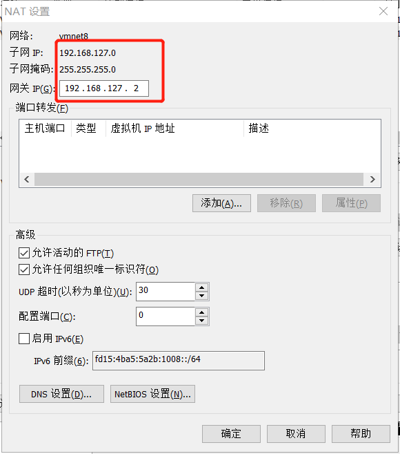
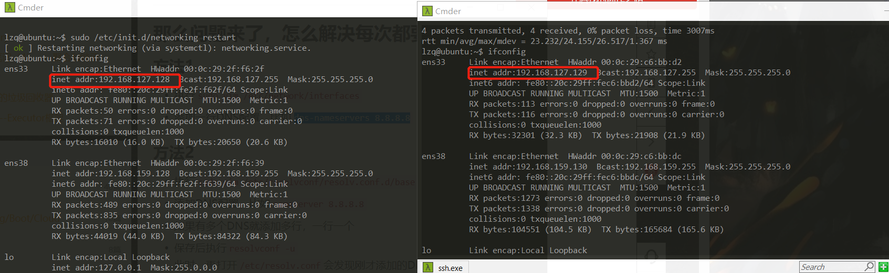
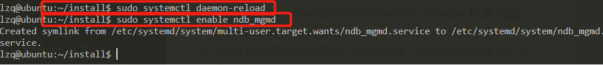
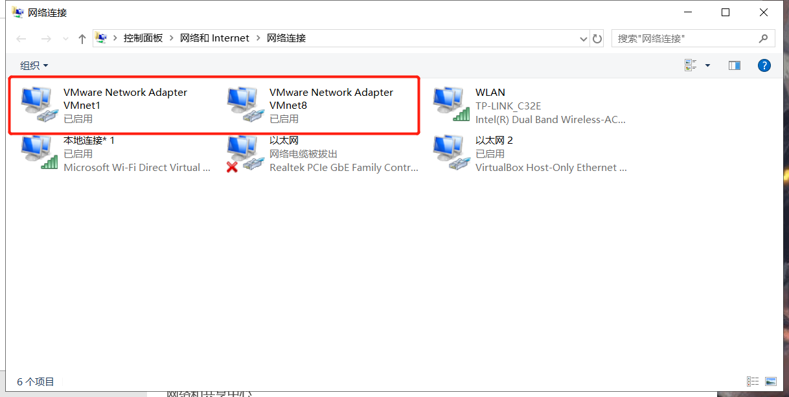

# 环境配置
## 实验背景
* vmware workstation pro12
* ubuntu-16.04-server-amd64.iso
* mysql-cluster_8.0.19-1ubuntu16.04_amd64.deb-bundle.tar
## 实验完成度
* [x] VMWare Ubuntu16.04的安装和基本准备
* [x] VMWare共享文件夹
* [x] VMWare设置静态IP地址
* [x] 第一步：集群配置
* [x] 第二步：准备
* [x] 第三步：安装配置集群管理器 
* [x] 第四步：配置数据节点
* [x] 第五步：配置并运行MySQL Server 和 Client
* [x] 第六步：验证MySQL Cluster安装
* [x] 第七步：向MySQL集群插入数据

## 实验过程
### VMWare Ubuntu16.04的安装和基本准备
1. vmware的许可证                  
                                      
2. [安装Ubuntu16.04](https://www.cnblogs.com/huozf/p/9780747.html)               
3. 启动双网卡                      
                                      
4. `ifconfig -a`查看所有的网卡,找到未启用网卡的网卡名`ens38`                    
                                      
5. `sudo vim /etc/network/interfaces`,将ens38的复制ens33即可，`sudo /etc/init.d/networking restart`
6. 换源`sudo vim /etc/apt/sources.list`，`sudo apt update`
```bash
deb https://mirrors.tuna.tsinghua.edu.cn/ubuntu/ xenial main restricted universe multiverse
# deb-src https://mirrors.tuna.tsinghua.edu.cn/ubuntu/ xenial main restricted universe multiverse
deb https://mirrors.tuna.tsinghua.edu.cn/ubuntu/ xenial-updates main restricted universe multiverse
# deb-src https://mirrors.tuna.tsinghua.edu.cn/ubuntu/ xenial-updates main restricted universe multiverse
deb https://mirrors.tuna.tsinghua.edu.cn/ubuntu/ xenial-backports main restricted universe multiverse
# deb-src https://mirrors.tuna.tsinghua.edu.cn/ubuntu/ xenial-backports main restricted universe multiverse
deb https://mirrors.tuna.tsinghua.edu.cn/ubuntu/ xenial-security main restricted universe multiverse
# deb-src https://mirrors.tuna.tsinghua.edu.cn/ubuntu/ xenial-security main restricted universe multiverse

```
### VMWare共享文件夹
1. 主机选择一个共享文件夹`D:\YearJunior2\AdvancedDatabase\vmshare`
2. 运行Ubuntu，"虚拟机"工具栏->安装vmware tool                   
                                      
3. 挂载 
```bash
sudo mkdir /mnt/cdrom 
sudo mount /dev/cdrom /mnt/cdrom
cd /mnt/cdrom
ls #可以看到tools
# 拷贝解压
cp VMwareTools-10.1.6-5214329.tar.gz /home/lzq
cd /home/lzq   
tar -xzvf VMwareTools-10.1.6-5214329.tar.gz

cd vmware-tools-distrib
sudo ./vmware-install.pl
```
                                       
4. 设置共享文件夹                        
                      
5. `cd /mnt/hgfs`可以看到设置的共享文件夹                              
                                      
### VMWare设置静态IP地址
1. 编辑->虚拟网络设置(没有删VMnet1)        
                                      
                                      
2. 虚拟设置->网络适配器->vmnet8            
                                  
3. `sudo vim /etc/network/interfaces`
```bash
# The loopback network interface
auto lo
iface lo inet loopback

# The primary network interface
auto ens33
#iface ens33 inet dhcp
iface ens33 inet static
address 192.168.127.129
netmask 255.255.255.0
gateway 192.168.127.2
dns-nameservers 223.5.5.5

auto ens38
iface ens38 inet dhcp
```
4. `sudo /etc/init.d/networking restart`重启网络                    
                                      

### 集群配置
1. 集群配置
```
数据节点1：192.168.127.128   nodeID   11
数据节点2：192.168.127.129   nodeID    12
管理节点：192.168.127.129     nodeID    1
sql节点1：192.168.127.128     nodeID   
sql节点2：192.168.127.129     nodeID
```
2. 卸载mysql(非常重要)
```bash
sudo apt-get autoremove --purge mysql-server
sudo apt-get remove mysql-server
sudo apt-get autoremove mysql-server
sudo apt-get remove mysql-common
```
### 准备
> 192.168.150.129
0. 更新源
```
sudo apt update
sudo apt-get update
```
1. 安装（mysql:0000）
```bash
sudo adduser mysql
sudo usermod -aG sudo mysql
```
2. 用sftp传输mysql-cluster
```bash
sftp lzq@192.168.159.130
lcd D:\share
put mysql-cluster_8.0.19-1ubuntu16.04_amd64.deb-bundle.tar
```
3. 安装
```bash
mkdir install
tar -xvf mysql-cluster_8.0.19-1ubuntu16.04_amd64.deb-bundle.tar -C install/
cd install
sudo apt install libaio1 libmecab2
```
4. 同理对另外一台虚拟机也做如此准备

### 安装配置集群管理器
> 192.168.50.129
1. 用dpkg指令在Cluster Manager 服务器 (假定为 192.168.50.129)上安装 ndb_mgmd
```bash
sudo apt install dpkg
sudo dpkg -i mysql-cluster-community-management-server_8.0.19-1ubuntu16.04_amd64.deb
```
                                      
2. 对其ndb_mgmd行配置,保证数据节点正确同步和负载分配
```bash
sudo mkdir /var/lib/mysql-cluster
sudo vim /var/lib/mysql-cluster/config.ini
```
3. 创建配置文件: `/var/lib/mysql-cluster/config.ini`：`sudo vim /var/lib/mysql-cluster/config.ini`
```bash
[ndbd default]
# Options affecting ndbd processes on all data nodes:
# Number of replicas
NoOfReplicas=2  

[ndb_mgmd]
# Management process options:
# Hostname of the manager
hostname=192.168.127.129  
NodeId=1
# Directory for the log files
datadir=/var/lib/mysql-cluster

[ndbd]
# Hostname/IP of the first data node
hostname=192.168.127.128
# Node ID for this data node 
NodeId=11
# Remote directory for the data files
datadir=/usr/local/mysql/data

[ndbd]
# Hostname/IP of the second data node
hostname=192.168.127.129
# Node ID for this data node
NodeId=12
# Remote directory for the data files
datadir=/usr/local/mysql/data

[mysqld]
# SQL node options:
# MySQL server/client i manager
hostname=192.168.127.129

[mysqld]
# SQL node options:
# MySQL server/client i manager
hostname=192.168.127.128
```
4. 启动管理器,`sudo ndb_mgmd -f /var/lib/mysql-cluster/config.ini`
                                      
5. 检查`ndb_mgmd`使用的端口1186,`sudo netstat -plntu`,在启动服务前，可能需要杀掉正在运行的服务,`sudo pkill -f ndb_mgmd`
                                        
6. 打开并编辑下面`systemd Unit`文件，使服务可以自动加载.`sudo vim /etc/systemd/system/ndb_mgmd.service`
```bash
[Unit]
Description=MySQL NDB Cluster Management Server
After=network.target auditd.service

[Service]
Type=forking
ExecStart=/usr/sbin/ndb_mgmd -f /var/lib/mysql-cluster/config.ini
ExecReload=/bin/kill -HUP $MAINPID
KillMode=process
Restart=on-failure

[Install]
WantedBy=multi-user.target
```        
7. 采用daemon-reload重新加载systemd’s manager 配置,`sudo systemctl daemon-reload`
8. 让我们刚创建的服务生效，使MySQL Cluster Manage 可以开机执行:,`sudo systemctl enable ndb_mgmd`
                                      
9. 启动服务,`sudo systemctl start ndb_mgmd`.
10. 验证NDB Cluster Management service服务正在执行,`sudo systemctl status ndb_mgmd`                            
                                      
这表明ndb_mgmd MySQL Cluster Management server 作为一个系统服务运行了
11. 设置Cluster Manager 允许其它MySQL Cluster 节点连入
```bash
sudo ufw allow from 192.168.127.128
sudo ufw allow from 192.168.127.129
```
                                      

### 配置一个数据节点
>假定在192.168.50.129上进行
1. 安装依赖包
```bash
sudo apt-get update
sudo apt-get install -f
sudo apt install libclass-methodmaker-perl
cd install
sudo dpkg -i mysql-cluster-community-data-node_8.0.19-1ubuntu16.04_amd64.deb
```                
                                      
2. 数据节点将从固定位置/etc/my.cnf获取配置文件.创建文件并编辑`sudo vim /etc/my.cnf`
```bash
[mysql_cluster]
# Options for NDB Cluster processes:
# location of cluster manager
ndb-connectstring=192.168.127.129
```
3. 本配置设定在管理器配置数据目录为`/usr/local/mysql/data`. 运行服务前要创建相关目录:`sudo mkdir -p /usr/local/mysql/data`
4. 可以启动服务了`sudo ndbd`                       
                                        
如果出现连接问题，请打开防火墙
```bash
sudo ufw allow from 192.168.127.129
sudo ufw allow from 192.168.127.128
```
5. 配置数据节点服务自启动.打开并编辑如下`systemd Unit`文件:`sudo vim /etc/systemd/system/ndbd.service`
内容如下:
```bash
[Unit]
Description=MySQL NDB Data Node Daemon
After=network.target auditd.service

[Service]
Type=forking
ExecStart=/usr/sbin/ndbd
ExecReload=/bin/kill -HUP $MAINPID
KillMode=process
Restart=on-failure

[Install]
WantedBy=multi-user.target
```
6. 采用`daemon-reload`重新加载`systemd’s manager `配置:`sudo systemctl daemon-reload`
7. 让我们刚创建的服务生效，使`data node daemon`可以开机执行:`sudo systemctl enable ndbd`
8. 关闭服务后`sudo pkill -f ndbd`，启动服务：`sudo systemctl start ndbd`
9. 验证NDB Cluster Management service服务正在执行:`sudo systemctl status ndbd`
                                      
10. 对`192.168.127.128`也进行这一系列操作,`/etc/my.cnf`文件不做修改                          
                                    

### 配置并运行MySQL Server 和 Client
1. 安装两个依赖库
```bash
sudo apt update
sudo apt install libaio1 libmecab2
```
2. 安装解压在install目录的软件包中的一些MySQL Cluster 依赖包
```bash
cd install
sudo dpkg -i mysql-common_8.0.19-1ubuntu16.04_amd64.deb
sudo dpkg -i mysql-cluster-community-client-core_8.0.19-1ubuntu16.04_amd64.deb
sudo dpkg -i mysql-cluster-community-client_8.0.19-1ubuntu16.04_amd64.deb
sudo dpkg -i mysql-client_8.0.19-1ubuntu16.04_amd64.deb
sudo dpkg -i mysql-cluster-community-server-core_8.0.19-1ubuntu16.04_amd64.deb
sudo dpkg -i mysql-cluster-community-server_8.0.19-1ubuntu16.04_amd64.deb #不要在cmder中做这一步
sudo dpkg -i mysql-server_8.0.19-1ubuntu16.04_amd64.deb
```
3. 配置MySQL server，`sudo vim /etc/mysql/my.cnf`,在文末添加
```bash
[mysqld]
# Options for mysqld process:
# run NDB storage engine
ndbcluster

[mysql_cluster]
# Options for NDB Cluster processes:
# location of management server
ndb-connectstring=192.168.127.129
```
4. 重启 MySQL server，使上面的变化生效,`sudo systemctl restart mysql`
5. MySQL默认开机自动启动.如果不能启动,下述命令可以修复:`sudo systemctl enable mysql`

### 验证MySQL Cluster安装
>为了验证 MySQL Cluster正确安装, 登陆 Cluster Manager / SQL Server节点（本指南为192.168.127.129）.
1. 打开MySQL 客户端连接到root 账号:`mysql -u root -p`,密码：0000
                                        
2. 系统会显示 NDB引擎的相关信息:`SHOW ENGINE NDB STATUS \G`           
                                      
3. 退出MySQL 客户端，使用quit 或按CTRL-D.               
4. 在集群管理器控制台上查看集群信息，命令如下:`ndb_mgm`              
                                      
5. 然后输入`SHOW`              
                                    
6. 退出管理控制台用quit命令.

### 向MySQL集群插入数据
1. 打开mysql客户端`mysql -u root -p`
2. 测试数据
```bash
# 创建数据库clustertest
CREATE DATABASE clustertest;

# 其次转到新数据库
USE clustertest;

# 创建表test_table:
# 这里需要显式规定ndbcluster引擎. 
CREATE TABLE test_table (name VARCHAR(20), value VARCHAR(20)) ENGINE=ndbcluster;

# 现在可以插入数据了:
INSERT INTO test_table (name,value) VALUES('lzq','999');

# 最后验证数据插入：
SELECT * FROM test_table;
```
                                        

## 实验问题
* Ubuntu  install提示
```
E: Could not get lock /var/lib/dpkg/lock-frontend - open (11: Resource temporarily unavailable)
E: Unable to acquire the dpkg frontend lock (/var/lib/dpkg/lock-frontend), is another process using it?
```
                                      
1. 问题应该是之前那个更新被强制取消的问题，进程仍然还在。用这个命令查看一下：`ps -e | grep apt`
2. `sudo killall apt`,`sudo killall apt-get`
3. 如果还不行,删除文件`sudo rm /var/lib/dpkg/lock-frontend`

* 在nat和host-only的网络环境下，虚拟机ping得通主机，主机ping不通虚拟机，但是virtualbox可以
1. 改为静态地址。多次重新装机及就不行
2. 后来发现是没有vmware对应的虚拟网卡                 
                                      
3. 控制面板->更改->修复。依旧没有用。
4. 卸载，一定要卸载完全
5. 安装好CCleaner后，打开，进行注册表操作                    
                                      
6. 关掉防火墙，打开以下几个服务
                                      
                                      
7. 然后重新安装
                                      

* `sudo dpkg -i mysql-cluster-community-management-server_7.6.6-1ubuntu18.04_amd64.deb`出现错误`dpkg: error processing archive mysql-cluster-community-management-server_7.6.6-1ubuntu18.04_amd64.deb (--install): cannot access archive: No such file or directory`
                                      
1. 版本不同，自己的ubuntu是16.04而这个包是18.04的
2. `ls`找到16.04对应的包`mysql-cluster-community-management-server_8.0.19-1ubuntu16.04_amd64.deb`，将之替换
                                      

* `sudo systemctl start ndb_mgmd`出现错误             
 `Job for ndb_mgmd.service failed because the control process exited with error code. See "systemctl status ndb_mgmd.service" and "journalctl -xe" for details.`
1. `journalctl -xe`看错误，发现是`Failed to start MySQL NDB Cluster Management Server.`
                                      
2. 报告上有这样一句话：`在启动服务前，可能需要杀掉正在运行的服务:  Shell>sudo pkill -f ndb_mgmd`，于是杀死进程后重新执行
```bash
sudo systemctl daemon-reload
sudo systemctl enable ndb_mgmd
sudo systemctl start ndb_mgmd
```
成功

* 非管理节点即.128`sudo ndbd`时会显示：
```bash
Unable to connect with connect string: nodeid=0,192.168.127.128:1186
Retrying every 5 seconds. Attempts left: 12 11 10 9 8 7 6 5 4 3 2 1, failed.
2020-04-13 16:42:49 [ndbd] ERROR    -- Could not connect to management server, error: ''
```
1. `/etc/my.cnf`中的IP地址不需要改成`192.168.127.128`,因为这里填的是管理节点的IP地址
                                      
                                      
                                        
## 实验结论

## 参考资料
* [安装Ubuntu16.04](https://www.cnblogs.com/huozf/p/9780747.html)
* [vmware虚拟机实现双网卡固定ip](https://blog.csdn.net/akakakak250/article/details/53127572)
* [ubuntu16.04 更新源详细操作步骤](https://blog.csdn.net/maizousidemao/article/details/79127695)
* [清华大学开源软件镜像站](https://mirrors.tuna.tsinghua.edu.cn/help/ubuntu/)
* [在win10环境下安装vmware软件后没有vmnet1、vmnet8虚拟网卡！](https://blog.csdn.net/qq_38021767/article/details/84028635)
* [查看发现没有 VMnet1 和VMnet8 。VMware12Pro的虚拟网络编辑器的主机链接是-，解决方案](https://blog.csdn.net/yhquser/article/details/93978578?depth_1-utm_source=distribute.pc_relevant.none-task-blog-OPENSEARCH-7&utm_source=distribute.pc_relevant.none-task-blog-OPENSEARCH-7)
* [安装VMware后，本机网络适配器中没有虚拟网卡VMnet1、VMnet8](https://blog.csdn.net/qq_33202508/article/details/87865912)
* [mysql-cluster下载](https://dev.mysql.com/downloads/cluster/)
