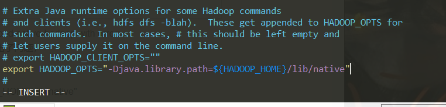

# noSQL数据库系统及Hadoop的安装与简单使用
## 实验背景
* ubuntu 16.04
    * db2
    * db1-base
## 实验完成度
* [x] 第一步：准备(ssh免密登录)
* [x] 第二步：安装jdk1.8
* [x] 第三步：安装hadoop-3.1.2
* [x] 第四步：hadoop伪分布式配置
* [x] 第五步：YARN 单机配置
* [x] 第六步：安装Hbase和简单使用
* [x] 第七步：Hbase配置伪分布模式
* [x] 第一步：准备
* [x] 第一步：准备
* [x] 第一步：准备
## 实验过程
### 一、准备
> 128虚拟机
1. 创建一个实验用户，如hadoop       
```bash
#创建hadoop用户，并使用/bin/bash作为shell
sudo useradd -m hadoop -s /bin/bash     
#为hadoop用户设置密码，之后需要连续输入两次密码 0000
sudo passwd hadoop                 
#为hadoop用户增加管理员权限  
sudo adduser hadoop sudo             
#切换当前用户为用户hadoop
su - hadoop                         
#更新hadoop用户的apt,方便后面的安装
sudo apt-get update                  
```
                                      
2. 安装SSH,设置SSH无密码登陆
```bash
sudo apt-get install openssh-server   #安装SSH server
ssh localhost                         #登陆SSH，第一次登陆输入yes
exit                                  #退出登录的ssh localhost
cd ~/.ssh/                           #如果没法进入该目录，执行一次ssh localhost
ssh-keygen -t rsa　　
# 输入完  $ ssh-keygen -t rsa　语句以后，需要连续敲击三次回车

cat ./id_rsa.pub >> ./authorized_keys     #加入授权
ssh localhost                         #此时已不需密码即可登录localhost，并可见下
```
                                      
                                      
### 二、安装jdk1.8
1. 从[jdk1.8官方网站](http://www.oracle.com/technetwork/java/javase/downloads/index.html)下载对应的jdk1.8（jdk-8u201-linux-x64.tar.gz）
2. 用sftp传送文件
```bash
sftp hadoop@192.168.159.128
lcd D:\share
lls
put jdk-8u201-linux-x64.tar.gz
put hbase-1.2.11-bin.tar.gz
put hadoop-3.1.2.tar.gz
exit
```
                                      
3. 安装
```bash
#创建jvm文件夹
sudo mkdir /usr/lib/jvm
# 解压到/usr/lib/jvm目录下
sudo tar zxvf jdk-8u201-linux-x64.tar.gz -C /usr/lib/jvm
#进入该目录
cd /usr/lib/jvm
#重命名为java
sudo mv jdk1.8.0_201 java
```
3. 给JDK配置环境变量,`vim ~/.bashrc`,在.bashrc文件添加如下指令
```bash
export JAVA_HOME=/usr/lib/jvm/java
export JRE_HOME=${JAVA_HOME}/jre
export CLASSPATH=.:${JAVA_HOME}/lib:${JRE_HOME}/lib:$CLASSPATH
export PATH=${JAVA_HOME}/bin:$PATH
```
                                      
4. 在文件修改完毕保存以后，在终端输入指令
```bash
#使新配置的环境变量生效
source ~/.bashrc
#检测是否安装成功，查看java版本
java -version
```
                                      

### 三、安装hadoop-3.1.2
1. 下载[hadoop-3.1.2.tar.gz](http://mirrors.tuna.tsinghua.edu.cn/apache/hadoop/common/hadoop-3.1.2/hadoop-3.1.2.tar.gz)，用sftp传输文件
2. 安装
```bash
cd ~
sudo tar -zxvf  hadoop-3.1.2.tar.gz  -C  /usr/local    #解压到/usr/local目录下
cd /usr/local
sudo mv hadoop-3.1.2 hadoop                     #重命名为hadoop
sudo chown -R hadoop ./hadoop         #修改文件权限，根据实际情况确定用户名
```
3. 给hadoop配置环境变量，`sudo vim ~/.bashrc`将下面代码添加到.bashrc文件:
```bash
export HADOOP_HOME=/usr/local/hadoop
export HADOOP_COMMON_LIB_NATIVE_DIR=$HADOOP_HOME/lib/native
export PATH=$PATH:$HADOOP_HOME/bin:$HADOOP_HOME/sbin
```
                                      
4. 同样，执行使设置生效，并查看hadoop是否安装成功
```bash
source ~/.bashrc
hadoop version
```
                                      

### 四、hadoop伪分布式配置
1. Hadoop可以在单节点上以伪分布式的方式运行，Hadoop 进程以分离的 Java 进程来运行，节点既作为 NameNode 也作为 DataNode，同时，读取的是 HDFS 中的文件。Hadoop 的配置文件位于 /usr/local/hadoop/etc/hadoop/ 中，伪分布式需要修改2个配置文件 core-site.xml和 hdfs-site.xml 。Hadoop的配置文件是 xml 格式，每个配置以声明property的name和value的方式来实现
2. 将jdk1.8的路径添加到hadoop-env.sh文件
```bash
# 找到路径
cd /usr/local/hadoop/etc/hadoop/ 
sudo vim hadoop-env.sh

## 添加
export JAVA_HOME=/usr/lib/jvm/java
```
                                      
3. 修改`core-site.xml`文件,`sudo vim core-site.xml`
```html
<configuration>
     <property>
          <name>hadoop.tmp.dir</name>
          <value>file:/usr/local/hadoop/tmp</value>
          <description>Abase for other temporary directories.</description>
     </property>
     <property>
          <name>fs.defaultFS</name>
          <value>hdfs://localhost:9000</value>
     </property>
</configuration>
```
                                      
4. 修改配置文件 `hdfs-site.xml`,`sudo vim hdfs-site.xml`
```html
<configuration>
     <property>
          <name>dfs.replication</name>
          <value>1</value>
     </property>
     <property>
          <name>dfs.namenode.name.dir</name>
          <value>file:/usr/local/hadoop/tmp/dfs/name</value>
     </property>
     <property>
          <name>dfs.datanode.data.dir</name>
          <value>file:/usr/local/hadoop/tmp/dfs/data</value>
     </property>
</configuration>
```
                                      
5. Hadoop 的运行方式是由配置文件决定的（运行 Hadoop 时会读取配置文件），因此如果需要从伪分布式模式切换回非分布式模式，需要删除 core-site.xml 中的配置项。此外，伪分布式虽然只需要配置 fs.defaultFS 和 dfs.replication 就可以运行（可参考官方教程），不过若没有配置 hadoop.tmp.dir 参数，则默认使用的临时目录为 /tmp/hadoo-hadoop，而这个目录在重启时有可能被系统清理掉，导致必须重新执行 format 才行。所以我们进行了设置，同时也指定 dfs.namenode.name.dir 和 dfs.datanode.data.dir，否则在接下来的步骤中可能会出错。
6. 执行 NameNode 的格式化
```bash
cd /usr/local/hadoop
./bin/hdfs namenode –format
```
                                        
7. 启动namenode和datanode进程，并查看启动结果
```bash
## 停止：./sbin/stop-dfs.sh
./sbin/start-dfs.sh
jps
```
                                      
8. 主机访问访问http://192.168.159.128:9870               
                                      
9. 运行一个例子
```bash
# 创建执行MapReduce作业所需的 DFS 目录
bin/hdfs dfs -mkdir /user
#  bin/hdfs dfs -mkdir /user/<username>
bin/hdfs dfs -mkdir /user/hadoop        #<username> 问用户名，如hadoop
# 拷贝输入文件到分布式文件系统:
bin/hdfs dfs -put etc/hadoop input

# 可以运行一些例子:
bin/hadoop jar share/hadoop/mapreduce/hadoop-mapreduce-examples-3.1.2.jar
bin/hadoop jar share/hadoop/mapreduce/hadoop-mapreduce-examples-3.1.2.jar grep input output 'dfs[a-z.]+'

#查看输出的文件(files): 从分布式文件系统中拷贝文件到本地文件系统并查看:
bin/hdfs dfs -get output output
cat output/*

#或者直接在分布式文件系统上查看:
bin/hdfs dfs -cat output/*
```

### 五、YARN 单机配置
1. 配置mapred-site.xml
```bash
cd /usr/local/hadoop/etc/hadoop/
sudo vim mapred-site.xml

## 配置
<configuration>
    <property>
        <name>mapreduce.framework.name</name>
        <value>yarn</value>
    </property>
</configuration>
```
                                     
2. 配置yarn-site.xml
```bash
sudo vim yarn-site.xml

## 配置
<configuration>
    <property>
        <name>yarn.nodemanager.aux-services</name>
        <value>mapreduce_shuffle</value>
    </property>
</configuration>
```
                                      
3. 启动ResourceManager daemon 和 NodeManager daemon:
```bash
cd /usr/local/hadoop
sbin/start-yarn.sh
```
                                      
访问http://192.168.159.128:8088/                      
4. 通过下列命令停止hadoop和YARN
```bash
sbin/stop-dfs.sh
sbin/stop-yarn.sh
```
                                      

### 六、安装Hbase和简单使用
1. 解压安装包hbase-1.2.11-bin.tar.gz至路径 /usr/local
```bash
cd ~
sudo tar -zxvf hbase-1.2.11-bin.tar.gz -C /usr/local
sudo mv /usr/local/hbase-1.2.11 /usr/local/hbase
cd /usr/local
#将hbase下的所有文件的所有者改为hadoop，hadoop是当前用户的用户名。
sudo chown -R hadoop ./hbase
```
2. 配置环境变量,给hbase配置环境变量，将下面代码添加到.bashrc文件:
```bash
vim ~/.bashrc
export PATH=$PATH:/usr/local/hbase/bin
```
                                      
3. 执行`source ~/.bashrc`使设置生效，并查看hbase是否安装成功`/usr/local/hbase/bin/hbase version`
                                        

### 七、Hbase配置伪分布模式
1. 配置hbase-env.sh
```bash
cd /usr/local/hbase/conf
sudo vim hbase-env.sh

## 加入
export JAVA_HOME=/usr/lib/jvm/java
```
                                      
2. 配置hbase-site.xml
```bash
sudo vim hbase-site.xml
## 配置
<configuration>
    <property>
              <name>hbase.rootdir</name>
              <value>hdfs://localhost:9000/hbase</value>
    </property>
    <property>
              <name>hbase.cluster.distributed</name>
              <value>true</value>
    </property>
</configuration>
```
                                      
3. 开启
```bash
cd /usr/local/hbase/bin
start-dfs.sh
start-hbase.sh
jps
```
                                      
4. 查看DFS中Hbase 目录，自动创建`hdfs dfs -ls /hbase`             
                                        
5. Start a backup HBase Master (HMaster) server,HMaster服务器控制 HBase集群. 你可以启动最多9个后备HMaster.
```bash
cd /usr/local/hbase/bin
local-master-backup.sh start 2 3 5
jps
```
                                      
6. 启动和停止附加区域服务器RegionServers
```bash
local-regionservers.sh start 2 3 4 5
jps
```
                                      
7. 进入交互界面:`hbase shell`                  
                                      
8. 进行一些基本数据库操作
```bash
# 创建表,cf为列族的名称
create 'test','cf'
# 使用list 命令可以显示表信息
list 'test'
# 使用 describe 命令显示表的详细信息
describe 'test'
# 向表中加入数据.使用 put 命令
put 'test','row1','cf:a','value1'
put 'test','row2','cf:b','value2'
put 'test','row3','cf:c','value3'
# 扫描表.使用scan 命令扫描整个表取得数据 
scan 'test'
# 取一行数据，使用get指令.
get 'test','row1'
# 修改表模式，使用alter命令，如修改存储版本数
disable 'test' 
# 对列族cf增加对历史版本的支持
alter 'test', NAME=>'cf',VERSIONS=>5
enable 'test'
```
                                      
                                      

## 实验问题
* 启动namenode和datanode进程，jps查看启动结果时没有namenode           
                                      
1. 从启动脚本打印的日志可知启动NameNode的日志是放在hadoop下的logs目录下，进入这个目录可发现有一个hadoop-namenode.log,打开这个日志可以看到错误，是文件目录不存在
                                      
2. 查看文件
```bash
cd /usr/local/hadoop/tmp/dfs
ls
```
                                     
3. 停止后，重新格式化namenode后再次查看，依旧没有
4. 清空tmp文件和log文件,然后再重新初始化，依旧不行
```bash
./sbin/stop-dfs.sh
rm -rf tmp/*
rm -rf logs/*
```
5. 自己添加一个name文件夹后重新format一下，仍然不行，查看日志，发现新的错误：格式化没有成功                          
                                      
6. 重新格式化
```bash
sbin/stop-all.sh
hadoop namenode -format
sbin/start-all.sh
jps
```
7. 第二台机子出现错误` Cannot create directory /usr/local/hadoop/tmp/dfs/name/current`权限不够
```bash
sudo su
sudo chmod -R a+w /usr/local/hadoop/tmp
exit
hadoop namenode -format
```
发现有了namenode                        
                                      

* 总是出现`WARN util.NativeCodeLoader: Unable to load native-hadoop library for your platform... using builtin-java classes where applicable`错误
1. `hadoop fs -ls`看到具体错误`Failed to load native-hadoop with error: java.lang.UnsatisfiedLinkError: no hadoop in java.library.path`,这表明是java.library.path出了问题
                                      
2. 修改配置文件
```bash
cd /usr/local/hadoop/etc/hadoop/ 
sudo vim hadoop-env.sh

## 添加
export HADOOP_OPTS="-Djava.library.path=${HADOOP_HOME}/lib/native"  
```
                                      

## 实验结论

## 参考资料
* [jdk1.8](http://www.oracle.com/technetwork/java/javase/downloads/index.html)
* [jdk1.8](https://www.oracle.com/technetwork/java/javase/downloads/jdk8-downloads-2133151.html)
* [hadoop-3.1.2.tar.gz](http://mirrors.tuna.tsinghua.edu.cn/apache/hadoop/common/hadoop-3.1.2/hadoop-3.1.2.tar.gz)
* [Hadoop出现错误：WARN util.NativeCodeLoader: Unable to load native-hadoop library for your platform... using builtin-java classes where applicable，解决方案](https://www.cnblogs.com/likui360/p/6558749.html)
* [HBase基本操作](https://www.cnblogs.com/yanzibuaa/p/8319004.html)